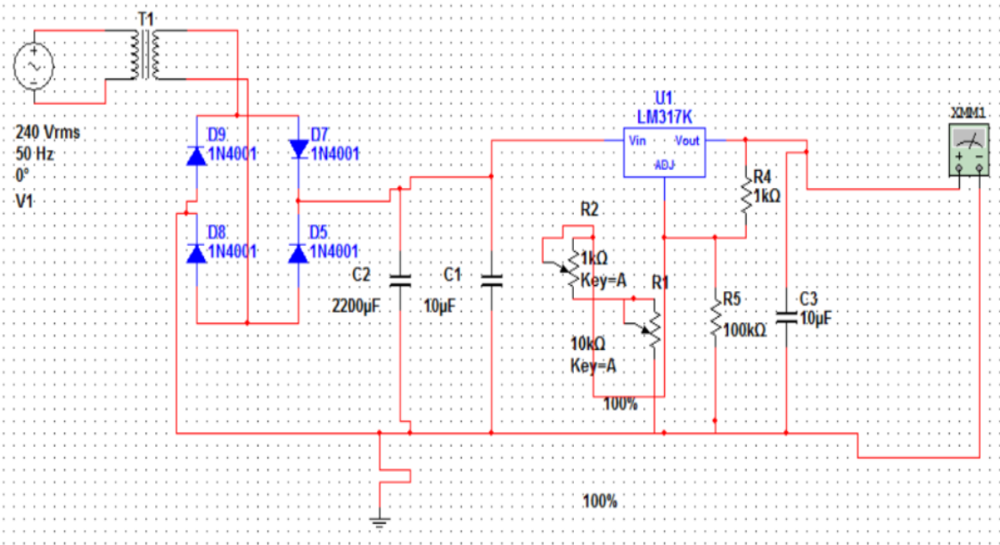
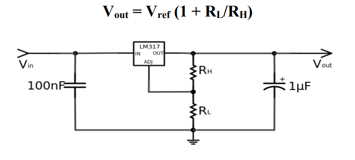
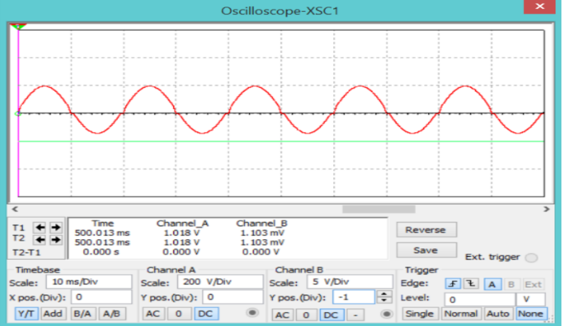
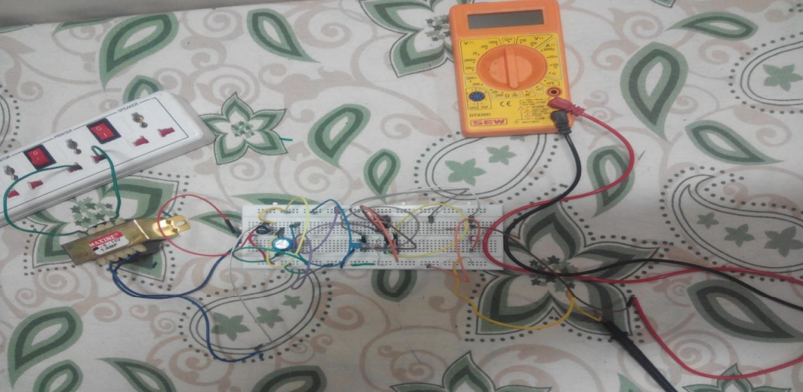

# Variable-DC-Power-Supply

A variable DC power supply is developed which provides a constant voltage in range 0V-15V. This system does not discharge over time as in case of batteries and thus maintains a constant supply. Based on the type of transformer and other components we can get the DC volatage in any range. This system can be used in any system requiring DC supply and serves as a perfect replacement for batteries.

## Circuit Diagram

## Working

1. A step down transformer is used to step down the AC supply.
2. A bridge rectifier is used to convert this voltage to DC.
3. This pulsating DC is filtered using the capacitor to get a clean DC and is given to LM317 which is variable voltage regulator IC.
4. The two potentiometers give feedback to the adjustment pin of LM317 which it adds to the input.
5. Depending on the adjustment of the potentiometer, we get different value of output DC voltage in the range 0-15 V. A resistive voltage divider between the output and ground is used so that the voltage of the output pin is continuously adjusted to be a fixed amount, the reference voltage, above that of the adjustment pin. Ideally, this makes the output voltage:

## Simulation Output

The project was simulated using NI Multisim.

Red -> Input AC Signal, Green -> Output DC Signal

## Hardware Setup

The hardware implementation on breadboard matched the simulation result. We got a constant variable DC voltage which could be varied to a voltage of any value using the two potentiometers.

